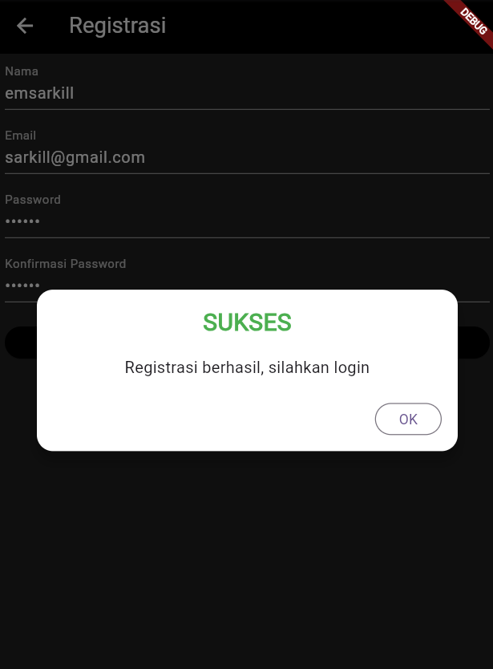
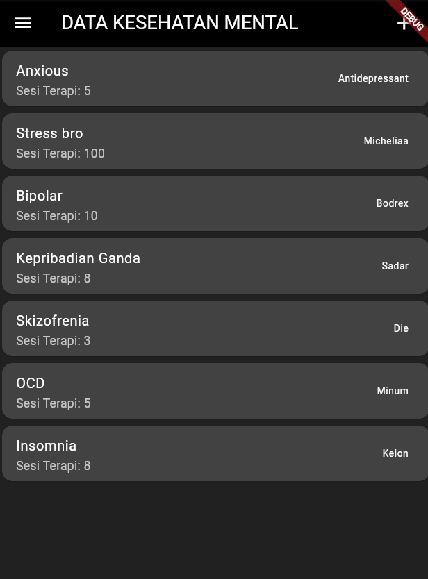
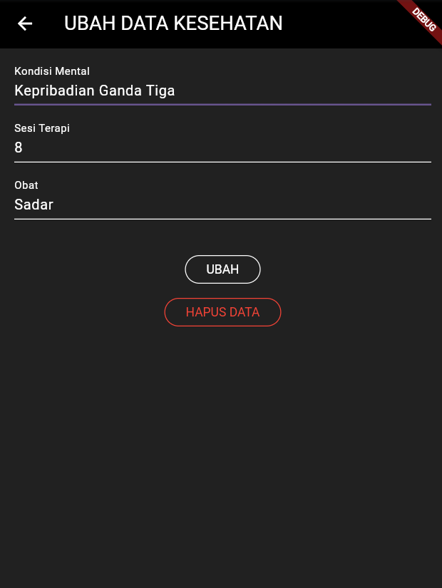
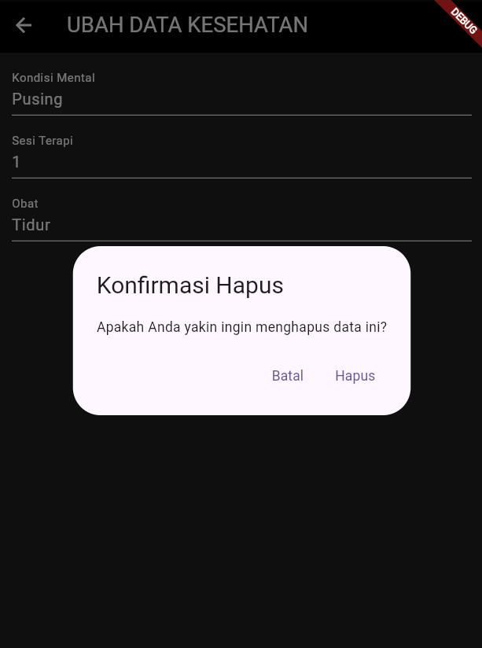
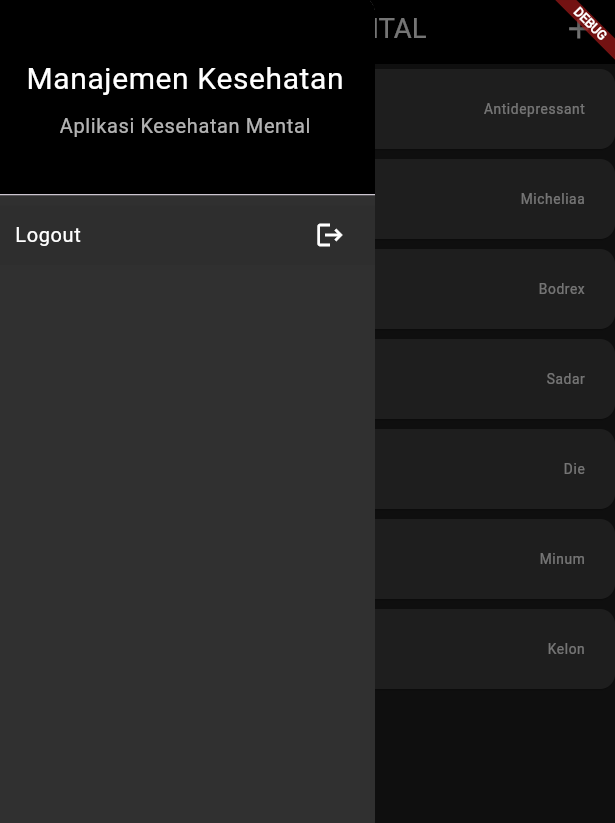

# aplikasi_manajemen_kesehatan

5. Halaman Kesehatan Mental Detail
Kode pada halaman kesehatan menytal detail adalah implementasi halaman detail untuk manajemen kesehatan mental dalam aplikasi Flutter. Halaman ini, yang dikelola oleh kelas KesehatanMentalDetail, dirancang untuk menampilkan rincian spesifik mengenai data kesehatan mental yang dipilih pengguna. Dalam konstruktor, kelas ini menerima parameter data bertipe KesehatanMental, yang berisi informasi seperti ID, kondisi mental, jumlah sesi terapi, dan pengobatan.

Tampilan halaman dibangun menggunakan Scaffold, yang menyediakan struktur dasar, termasuk AppBar berwarna hitam dengan judul "Detail Kesehatan Mental" yang ditulis dengan font Georgia. Bagian tubuh halaman dilengkapi dengan padding untuk memberikan ruang di sekitar konten. Rincian data ditampilkan dalam kolom dengan menggunakan metode _buildDetailText, yang memformat teks label dan nilai dalam ukuran 18 piksel dan warna putih. Di antara setiap rincian terdapat garis pemisah (Divider) untuk meningkatkan keterbacaan.

Pada bagian bawah halaman, terdapat dua tombol, yaitu tombol "EDIT" dan "DELETE". Tombol "EDIT" memungkinkan pengguna untuk mengubah data yang ditampilkan dengan mengarahkan mereka ke halaman formulir (KesehatanMentalForm). Tombol "DELETE" memanggil metode _confirmHapus, yang menampilkan dialog konfirmasi sebelum penghapusan data. Jika pengguna mengkonfirmasi penghapusan, metode KesehatanMentalBloc.deleteDataKesehatanMental dipanggil untuk menghapus data dari backend. Jika penghapusan berhasil, pengguna akan diarahkan kembali ke halaman KesehatanMentalPage, sedangkan jika gagal, dialog peringatan akan ditampilkan untuk memberi tahu pengguna.